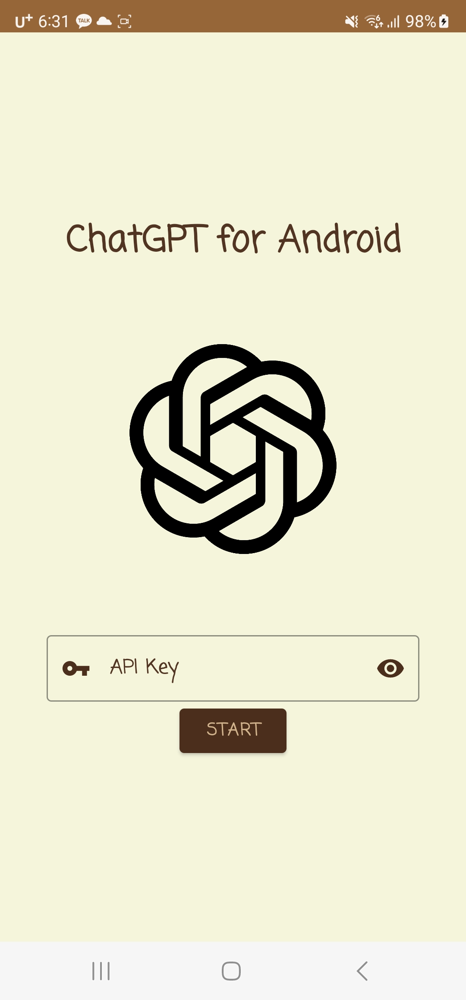
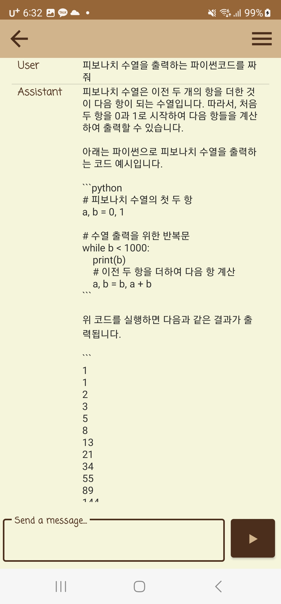
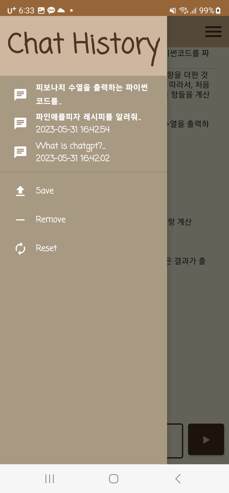
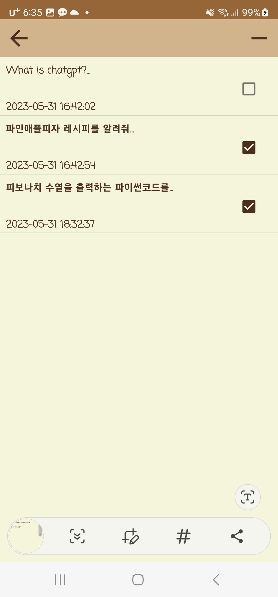

# ChatGPT-for-Android

## Description

안드로이드에서 사용할 수 있는 ChatGPT앱입니다.    
사용하려면 OpenAI API키가 필요합니다. 키는 [이곳](https://platform.openai.com/account/api-keys) 에서 받을 수 있습니다.

## How to Use

API키를 입력하고 START버튼을 누르면 채팅 창으로 이동합니다.   
아래에 표시된 텍스트 입력바에 메시지를 입력하고 전송 버튼을 누르면 채팅이 시작됩니다.   
왼쪽 위에 있는 메뉴 버튼을 클릭하여 채팅 기록을 초기화, 저장, 삭제, 로드 할 수 있습니다.    

## Images

